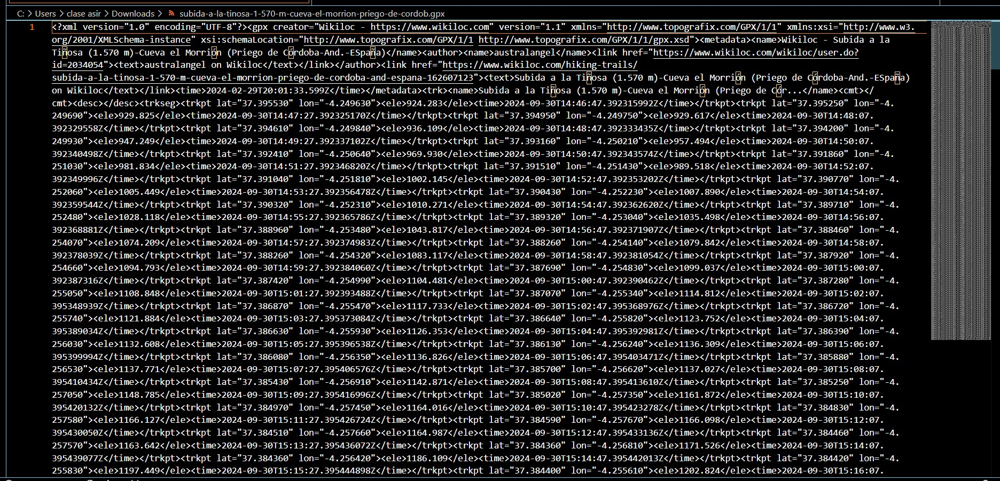
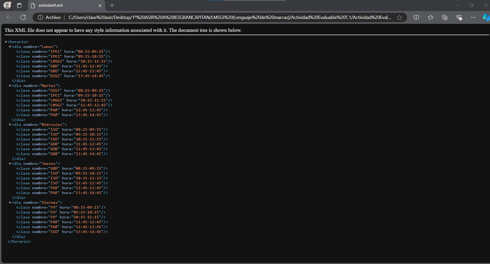

## Actividades Evaluables
# Actividad 1: Utiliza markdown para crear un documento personal de presentación incluyendo una foto.

> *Mis datos personales*
- **Nombre:** 
  - *Manuel Jesús*
- **Apellidos:**
  - *Pérez Mariscal*
- **Ciudad de origen:**
    - *Córdoba*
- **Hobbies:**
  1. Jugar al fútbol
  2. Ir al gimnasio
  3. Salir con mis amigos
- **Tus redes sociales, correo electrónico**
  - Instagram:
    - *_maanuperez*
  - Correo electrónico:
    - **a24pemama@iesgrancapitan.org**
- **Tu cita favorita:**
  >*Es un maratón no un sprint* 
  - *"JUDE BELLINGHAM"*
- Una foto tuya:

# Actividad 2: **¿Conoces wikiloc?** Se trata de una aplicación orientada al senderismo y con múltiples rutas. En esta actividad debes localizar una ruta de subida a la Tiñosa e incluir en tu blog una entrada desde el punto de vista de Lenguaje de Marcas.

# Actividad 3: **¿Conoces el formato gift?** En esta actividad te proponemos que elabores un cuestionario con 5 preguntas de elección múltiple para importar a nuestra plataforma educativa. Por supuesto, las preguntas deben ser sobre la introducción a los lenguajes de marcas.

# Actividad 4: Crea un documento XML que almacene la información de tu horario. Comprueba que está bien formado abriéndolo en el navegador.
